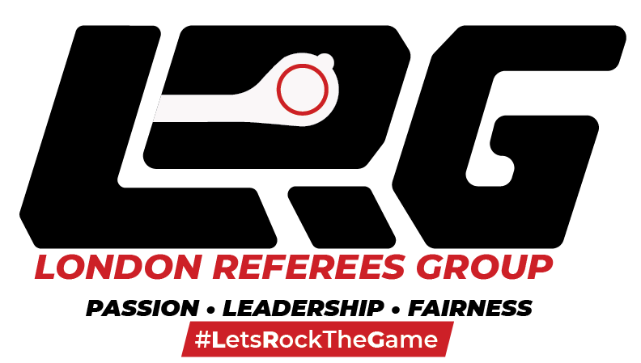

# LRG_winter2021_pitch


# Description

A revamp of London Referees Group's official website. It includes updating content, layout, and improving user experience and navigation for better conversions and site performance. The main goal is to improve the usability of the website for its members, provides information for future officials, and encourage users to apply for their existing/upcoming programs.<br>

This is a collaboration of graduating students of Interactive Media<br>
Project Manager : Elaine Balgos<br>
Graphic Designer : Xindi Lu<br>
Motion Designer : Ruben Osorio<br>
Frontend Developer :Guangli Li<br>
Backend Developer : Shan-li Wang <br>

# How To Run

1. :link: [Live Demo](https://londonreferees.com/)

2. **Docker**: (Download files and import database first)

```
docker-compose up
```

3. **Wamp/Mamp** (Download files and import database first)

## Password

| User Type        | Username           | Password  |
| ------------- |:-------------:| -----:|
| Admin  | shield1 | shield1 |
| Admin  | shield2     |   shield2 |
| Member | spiderman      |    marvel |
| Member | batman      |    dc |

# Prototypes

[DESKTOP](https://xd.adobe.com/view/e7c7d666-032d-434f-bef2-5c40cb4fb344-b294/)<br>
[MOBILE](https://xd.adobe.com/view/81a6dcf1-314c-479e-b68a-82c97da11f7a-d4f5/)<br>

# Styleguide

[LRG BRAND GUIDELINE](https://drive.google.com/file/d/1P-iuW2frcjx49tLJFVgmhQHHV8_PRXRL/view?usp=sharing)<br>

# Roadmap

[DESIGNER AND DEVELOPER NOTES](https://docs.google.com/document/d/1dnMzIItQJXBdz44r2DFuqHdKDsmTiPsivwNlWZ1WLjU/edit?usp=sharing)<br>

## Technologies

- MAMP/WAMP
- Visual Studio Code
- Postman

## Prerequisites

- HTML
- CSS/SASS
- Javascript
- Vue
- PHP
- MySQL
- Docker

## License

This project is licensed under the [MIT]
([MIT](https://choosealicense.com/licenses/mit/)) license

Copyright (c) 2021 ElaineBalgos_XindiLu_RubenOsorio_GuangliLi_ShanliWang

Permission is hereby granted, free of charge, to any person obtaining a copy of this software and associated documentation files (the "Software"), to deal in the Software without restriction, including without limitation the rights to use, copy, modify, merge, publish, distribute, sublicense, and/or sell copies of the Software, and to permit persons to whom the Software is furnished to do so, subject to the following conditions:

The above copyright notice and this permission notice shall be included in all copies or substantial portions of the Software.

THE SOFTWARE IS PROVIDED "AS IS", WITHOUT WARRANTY OF ANY KIND, EXPRESS OR IMPLIED, INCLUDING BUT NOT LIMITED TO THE WARRANTIES OF MERCHANTABILITY, FITNESS FOR A PARTICULAR PURPOSE AND NONINFRINGEMENT. IN NO EVENT SHALL THE AUTHORS OR COPYRIGHT HOLDERS BE LIABLE FOR ANY CLAIM, DAMAGES OR OTHER LIABILITY, WHETHER IN AN ACTION OF CONTRACT, TORT OR OTHERWISE, ARISING FROM, OUT OF OR IN CONNECTION WITH THE SOFTWARE OR THE USE OR OTHER DEALINGS IN THE SOFTWARE.
